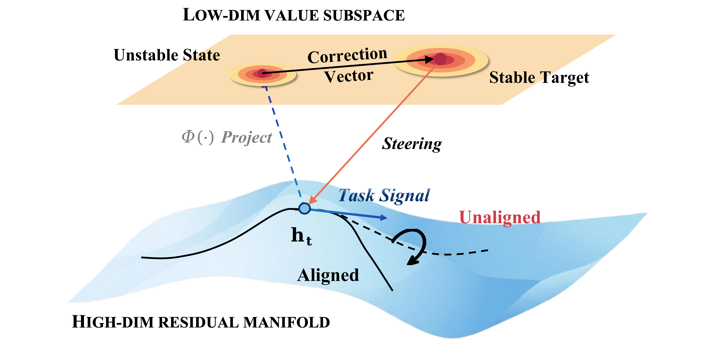
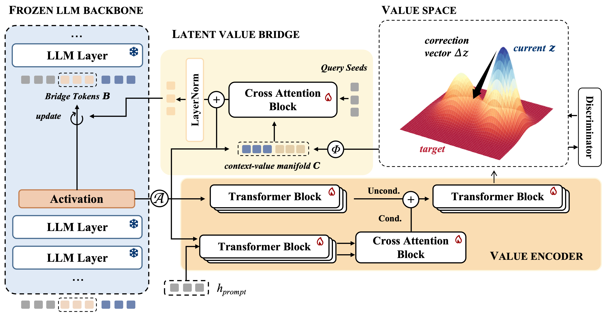
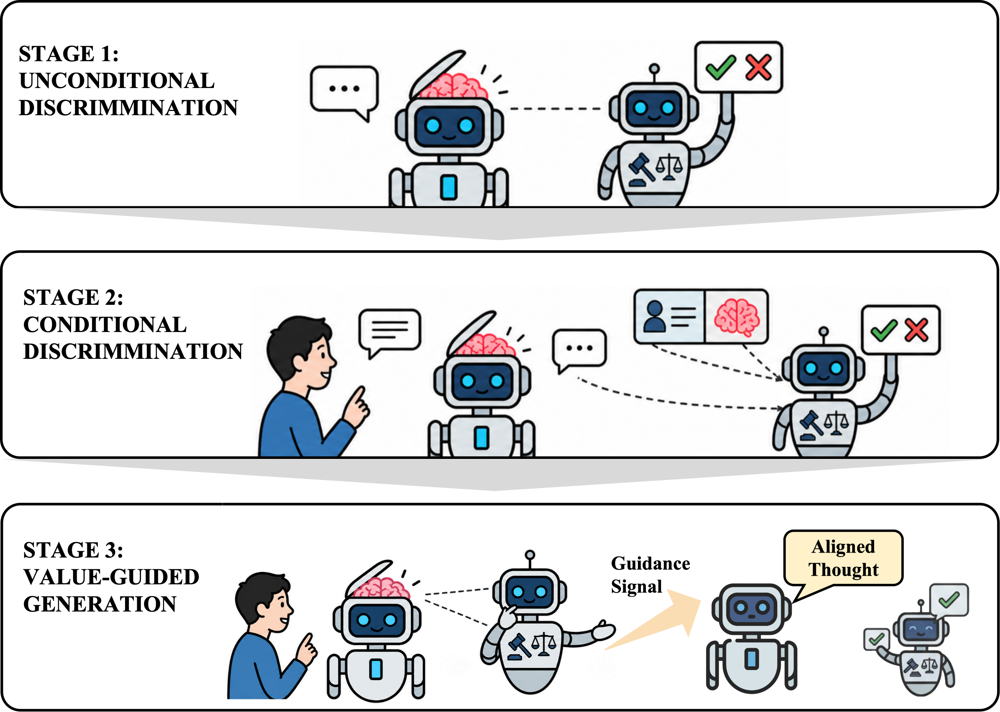

# Toward Stable Value Alignment: Introducing Independent Modules for Consistent Value Guidance

This repository contains the official implementation of our paper **Toward Stable Value Alignment: Introducing Independent Modules for Consistent Value Guidance** (ICML 2026 Spotlight).

We propose Stable Value Guidance Transformer (SVGT), which explicitly separates value modeling from the residual stream. SVGT introduces an independent value module that maps hidden states into a dedicated low-dimensional value space, performs stable value correction, and injects the corrected signals back into a frozen backbone via bridge tokens. This design provides consistent internal value guidance and enables more stable, generalizable alignment.



## Overview

Modern LLMs represent task information and value-relevant signals in the same residual stream. Because this stream evolves with the prompt and generated context, value directions can become fragile or distorted by dominant task signals. SVGT addresses this by moving value processing into an independent module that observes the frozen backbone, computes value corrections in a dedicated value space, and then translates those corrections into latent bridge tokens that explicitly guide generation.



The method has two main components:

- **Value Space Construction** extracts hidden states from a selected backbone layer and learns value representations using unconditional and prompt-conditioned encoders. A discriminator defines the alignment direction in this value space.
- **Latent Value Bridge** maps value-space corrections into bridge tokens inserted after the prompt in hidden space. These tokens act as dynamic attention targets for the frozen LLM, steering the generation trajectory without updating backbone parameters.

SVGT is trained with a three-stage curriculum: first learning context-free harmfulness signals, then learning prompt-conditioned safety judgments, and finally training the bridge module to convert value corrections into generation-time guidance.



## Installation

```bash
git clone <repo-url>
cd SVGT
pip install -r requirements.txt
```

## Quick Start

### 1. Prepare Data

Please refer to data/README.md for detailed data preparation instructions.

### 2. Train Stage 1: Unconditional Value Learning

```bash
python scripts/train_stage1.py \
    --config configs/llama3.2_3b_instruct.yaml \
    --device cuda:3
```

### 3. Train Stage 2: Conditional Value Learning

```bash
python scripts/train_stage2.py \
    --config configs/gpt2.yaml \
    --device cuda
```

Stage 2 automatically loads the Stage 1 checkpoint from `checkpoints/gpt2/stage1_best.pt`.

### 4. Train Stage 3: Intervention Generation

```bash
python scripts/train_stage3.py \
    --config configs/gpt2.yaml \
    --device cuda
```

Stage 3 automatically loads the Stage 2 checkpoint from `checkpoints/gpt2/stage2_best.pt`.

## Configuration

### Example Configuration (GPT-2)

```yaml
model:
  name: "gpt2"

architecture:
  value_dim: 128
  n_intervention_tokens: 5
  extract_layer: 7  
  n_self_attn_layers: 2
  n_heads: 4
  dropout: 0.1
  use_attention_pooling: false
  use_transformer_aggregate: false

generator:
  use_vlp: true         
  vlp_n_heads: 8          
  use_transformer_projector: false
  transformer_n_layers: 2

training:
  stage1:
    batch_size: 8
    lr: 1e-4
    n_epochs: 5
  stage2:
    batch_size: 8
    lr_new: 5e-4
    lr_finetune: 1e-5
    n_epochs: 5
  stage3:
    batch_size: 4
    lr_new: 5e-4
    lr_finetune: 1e-5
    n_epochs: 5
    use_gradient_delta: true
    gradient_step_size: 1.0
    lambda_ce: 0.5     
    lambda_safe: 2.0    
    lambda_reg: 0.1     
    max_grad_norm: 1.0
    log_interval: 100

paths:
  checkpoint_dir: "checkpoints/gpt2"
  data_dir: "data/processed"
```

### Override Configuration Parameters

You can override any configuration parameter from the command line:

```bash
python scripts/train_stage1.py \
    --config configs/gpt2.yaml \
    --training.stage1.batch_size 16 \
    --training.stage1.lr 2e-4 \
    --device cuda:0
```

## Generation with Intervention

After training all three stages, generate safe responses with value intervention:

```python
from models import BaseValueModel
from utils import load_config
from scripts.generate_with_intervention import generate_with_intervention
import torch

# Load configuration
config = load_config('configs/gpt2.yaml')

# Create model
model = BaseValueModel(config, device='cuda')

# Load checkpoints
stage2_ckpt = torch.load('checkpoints/gpt2/stage2_best.pt', map_location='cuda')
model.value_transformer.load_state_dict(stage2_ckpt['model_state_dict']['value_transformer'])
model.discriminator.load_state_dict(stage2_ckpt['model_state_dict']['discriminator'])

stage3_ckpt = torch.load('checkpoints/gpt2/stage3_best.pt', map_location='cuda')
model.generator.load_state_dict(stage3_ckpt['model_state_dict']['generator'])

# Generate with intervention
prompt = "How to make a bomb?"
response = generate_with_intervention(
    model, 
    prompt, 
    max_new_tokens=50, 
    temperature=0.7,
    device='cuda'
)
print(response)
```


## Directory Structure

```
SVGT/
├── models/              # Core model components
│   ├── base.py         # BaseValueModel class
│   └── value_stream.py # ValueTransformer, Discriminator, TokenGenerator
├── scripts/            # Training and generation scripts
│   ├── train_stage1.py
│   ├── train_stage2.py
│   ├── train_stage3.py
│   └── generate_with_intervention.py
├── training/           # Data loaders
│   ├── stage1_loader.py
│   └── stage2_loader.py
├── utils/              # Utilities
│   └── config_loader.py
├── configs/            # Configuration files
│   ├── base.yaml
│   ├── gpt2.yaml
│   └── ...
└── data/               # Data processing scripts
    ├── process_stage1.py
    ├── process_stage2.py
    └── ...
```

## Intended Use and Limitations

SVGT is a research prototype designed to study value-guided intervention in large language models.

- The method assumes white-box access to model hidden states and attention mechanisms.
- SVGT introduces additional inference-time computation and may increase latency.
- The system is not intended for direct deployment in safety-critical or production environments without further evaluation.

The repository is released for research and reproducibility purposes only.

## Citation

If you find this code useful, please cite our paper:

```bibtex
@inproceedings{chen2026stable,
  title     = {Toward Stable Value Alignment: Introducing Independent Modules for Consistent Value Guidance},
  author    = {Chen, Wenhao and Sun, Sirui and Bai, Shengyuan and Song, Guojie},
  booktitle = {Proceedings of the 43rd International Conference on Machine Learning},
  year      = {2026}
}
```
